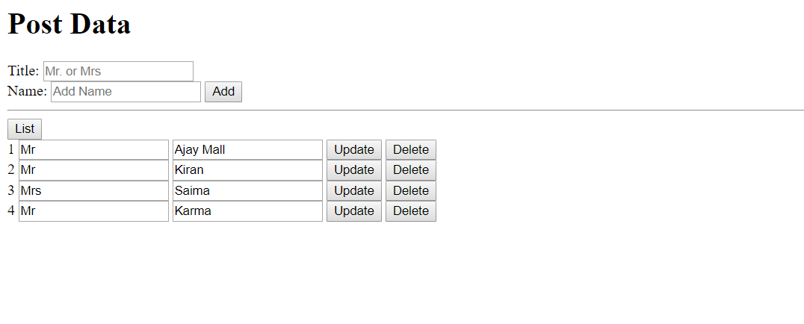

# Simple-AJAX-CRUD-Using-JavaScript

1. *Install*
    1. install node and npm
    2. to create JSON Server `Install npm i json-server -g`
    3. `npm init`
    4. `npm install json-server --save-dev`

2. Image Refernece 

